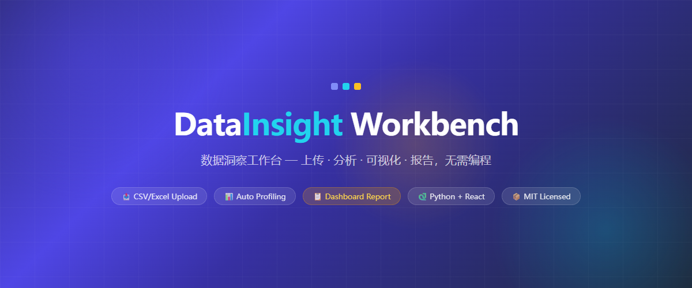
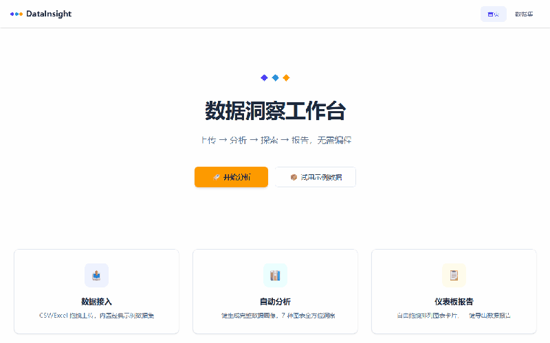

<p align="center">
  
</p>

<h1 align="center">DataInsight Workbench</h1>
<p align="center">
  <strong>数据洞察工作台 — 上传 · 分析 · 可视化 · 报告，无需编程</strong>
</p>

<p align="center">
  
  
  
  
</p>

## Demo

<p align="center">
  
</p>
<em align="center">上传 CSV → 数据预览 → 交互图表探索 → 仪表板报告，全流程 30 秒</em>
</p>

---

## 目录

- [项目介绍](#项目介绍)
- [功能预览](#功能预览)
- [技术栈](#技术栈)
- [快速开始](#快速开始)
- [架构](#架构)
- [项目结构](#项目结构)
- [Roadmap](#roadmap)
- [贡献](#贡献)
- [许可证](#许可证)

---

## 项目介绍

**DataInsight Workbench**（数据洞察工作台）是一个集数据上传、自动分析、可视化报告生成于一体的 Web 数据分析平台。

### 目标用户

- **数据分析初学者** — 无需编写代码即可完成数据探索与可视化
- **业务分析师** — 快速验证数据假设、生成可视化报告
- **教育场景** — 教学中演示数据分析基本流程

### 核心理念

**上传即出报告**。用户从拖拽上传 CSV/Excel 文件开始，平台自动完成数据概览分析，随后提供 7 种交互图表供自由探索，最终可拖拽组装为仪表板报告——全程无需编程。

### 亮点

- 拖拽上传 CSV / Excel，内置示例数据集
- 自动数据概览：行数、列数、缺失值、描述统计
- 7 种图表类型自由配置，支持交互缩放与筛选
- 仪表板拖拽排列，一键导出报告
- Docker Compose 一键启动，无需配置环境

---

## 功能预览

| 数据上传 | 交互探索 | 仪表板报告 |
|:---:|:---:|:---:|
| CSV/Excel 拖拽上传，<br>内置示例数据集 | 7 种图表类型，<br>自由配置 X/Y 轴与聚合方式 | 拖拽排列卡片，<br>一键导出报告 |

> **界面截图：**
>
> | 页面 | 说明 |
> |:---|:---|
> | 数据上传页 | 拖拽上传 + 示例数据集选择 |
> | 数据预览页 | 表格预览 + 列级统计 + 数据清洗 |
> | 交互探索页 | 7 种图表 + 字段配置面板 |
> | 仪表板页 | 图表卡片拖拽排列 |

---

## 技术栈

| 层 | 技术 |
|----|------|
| 前端框架 | React 18 + TypeScript + Vite |
| UI 样式 | Tailwind CSS |
| 图表引擎 | ECharts |
| 后端框架 | Python FastAPI |
| 数据分析 | pandas + numpy + scipy |
| 数据库 | SQLite |
| 部署方案 | Docker Compose |

---

## 快速开始

### 前置要求

- **Docker 方式：** Docker 和 Docker Compose（推荐）
- **手动方式：** Node.js 18+、Python 3.10+、pip

### 方式一：Docker Compose（推荐）

```bash
git clone https://github.com/<your-github-username>/datainsight-workbench.git
cd datainsight-workbench
docker-compose up
```

启动后访问 **http://localhost:3000**

### 方式二：手动启动

**1. 克隆项目**

```bash
git clone https://github.com/<your-github-username>/datainsight-workbench.git
cd datainsight-workbench
```

**2. 启动后端**

```bash
cd backend
pip install -r requirements.txt
uvicorn main:app --reload --port 8000
```
输入python -m uvicorn main:app --reload --port 8000
后端 API 运行在 http://localhost:8000

**3. 启动前端**（新开终端）

```bash
cd frontend
npm install
npm run dev
```

前端页面访问 http://localhost:5173

---

## 架构

```
用户 → React SPA → REST API → FastAPI → pandas 分析引擎 → SQLite
                 ↕ ECharts 渲染      ↕ 7种图表数据
```

### 数据流说明

1. **上传阶段**：用户通过前端拖拽上传 CSV/Excel 文件，文件发送至 FastAPI 后端解析入库
2. **分析阶段**：后端调用 pandas 进行数据概览（描述统计、缺失值、数据类型等）
3. **探索阶段**：用户在前端配置图表参数（图表类型、X/Y 轴、聚合方式），后端计算后返回 ECharts 兼容的配置数据
4. **报告阶段**：用户将图表卡片拖拽排列生成仪表板，数据持久化存储于 SQLite

### 前后端分离架构

- **前端**：React SPA，使用 Vite 构建。组件按页面组织（Upload / Preview / Explore / Dashboard），共享 UI 组件库（Button、Card、Input、Select、Spinner 等）
- **后端**：FastAPI 应用，按路由模块组织（data / profile / chart / datasets），各路由调用对应的 service 层完成业务逻辑
- **通信**：前后端通过 REST API 交换 JSON 数据

---

## 项目结构

```
datainsight-workbench/
├── assets/
│   └── banners/              # README banner 及功能截图
│       ├── readme-banner.html
│       ├── feature-upload.html
│       ├── feature-explore.html
│       └── feature-dashboard.html
├── backend/
│   ├── main.py               # FastAPI 应用入口
│   ├── config.py             # 配置管理
│   ├── database.py           # SQLite 数据库连接
│   ├── requirements.txt      # Python 依赖
│   ├── routers/
│   │   ├── data.py           # 数据上传与预览 API
│   │   ├── profile.py        # 数据概览分析 API
│   │   ├── chart.py          # 图表数据 API
│   │   └── datasets.py       # 示例数据集 API
│   ├── services/
│   │   ├── parser.py         # CSV/Excel 解析
│   │   ├── profiler.py       # 数据概算引擎
│   │   └── chart_builder.py  # 图表数据生成
│   ├── models/
│   │   ├── schemas.py        # Pydantic 数据模型
│   │   └── db_models.py      # SQLAlchemy 模型
│   ├── tests/
│   │   ├── test_parser.py
│   │   ├── test_profiler.py
│   │   └── test_chart_builder.py
│   └── data/                 # SQLite 数据文件目录
├── frontend/
│   ├── src/
│   │   ├── main.tsx          # 应用入口
│   │   ├── App.tsx           # 路由配置
│   │   ├── index.css         # Tailwind 入口 + 全局样式
│   │   ├── pages/
│   │   │   ├── UploadPage.tsx
│   │   │   ├── PreviewPage.tsx
│   │   │   ├── ExplorePage.tsx
│   │   │   └── HomePage.tsx
│   │   ├── components/
│   │   │   ├── ui/           # Button, Card, Input, Select 等基础组件
│   │   │   ├── upload/       # DropZone, UploadProgress, SampleDatasetPicker
│   │   │   ├── preview/      # DataTable, ColumnStatsPanel, CleanToolbar
│   │   │   ├── explore/      # ChartTypeSelector, EChartsView, FieldPanel
│   │   │   └── layout/       # Navbar, PageShell
│   │   ├── context/
│   │   │   └── DatasetContext.tsx
│   │   ├── hooks/
│   │   │   └── useChart.ts
│   │   ├── api/
│   │   │   └── client.ts     # API 客户端封装
│   │   └── utils/
│   │       └── echarts-theme.ts
│   ├── index.html
│   ├── vite.config.ts
│   ├── package.json
│   └── tsconfig*.json
├── tests/                    # 集成测试 / E2E 测试
├── docs/                     # 项目文档
├── docker-compose.yml        # Docker Compose 编排
├── .gitignore
├── README.md
└── LICENSE
```

---

## Roadmap

- [x] **M1: 数据上传与预览**
  - CSV/Excel 拖拽上传
  - 示例数据集选择
  - 数据表格预览 + 列级统计
  - 数据清洗工具
- [x] **M2: 自动分析与交互图表**
  - 自动数据概览（描述统计、缺失值分析）
  - 7 种图表类型（柱状图、折线图、散点图、饼图、箱形图、热力图、雷达图）
  - 图表字段自由配置（X/Y 轴、聚合方式）
  - ECharts 交互（缩放、悬停、图例切换）
- [x] **M3: 仪表板报告**
  - 仪表板增删改查
  - 图表卡片拖拽排列
  - 全屏演示模式
  - 一键导出报告
- [ ] **v2: 进阶分析**
  - 预测建模（线性回归、时间序列）
  - PDF 报告导出
- [ ] **v3: 平台化**
  - 用户注册 / 登录系统
  - 多数据集管理
  - 数据分析分享

---

## 贡献

欢迎提交 Issue 和 Pull Request。

1. Fork 本仓库
2. 创建特性分支：`git checkout -b feat/your-feature`
3. 提交改动：`git commit -m "feat: add your feature"`
4. 推送到分支：`git push origin feat/your-feature`
5. 创建 Pull Request

请确保代码通过 ESLint 检查并添加相应测试。

---

## 许可证

[MIT](LICENSE) © 2026 DataInsight Workbench
